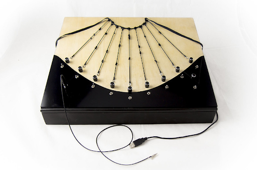

# Electronic_Khipu_ $${\color{blue}Patricia\ Cadavid}$$

The **Electronic_Khipu_** is a NIME designed to create live experimental sound through knot-making with conductive rubber cords. It is inspired by the *Khipu*, an ancient information storage and transmission device used by the Incas and earlier Andean societies. Its name comes from the Kichwa word “khipu,” meaning “knot.”

>A khipu consists of a central cord from which secondary strings are detached with knots of different shapes, colors, and sizes that constituted a set of signs that could be used to make numerical records or to account for important facts or events. The khipu has been known for its accounting and statistical utilities, but nowadays it has been discovered that the Khipus also contained several layers of memory that include not only arithmetic data butalso economic, social, biological, historical, astronomical, linguistic and literary records (Cadavid, NIME 2020).

The concept behind the **Electronic_Khipu_** is to revive this ancient device, offering a different interpretation than the Western view, which sees it solely as a numerical system for observation and study, devoid of deeper meaning or "soul." Instead, the **Electronic_Khipu_** reuses the Khipu’s code system to create new messages and sonic narratives.

## Technical notes
The **Electronic_Khipu_** consists of a root cord and nine secondary strings arranged in a wooden box with various potentiometers and buttons to control the signal. The secondary cords are made from conductive rubber sensors, which function as variable resistors to measure tension that increases with each knot added. The entire setup is managed by a Teensy board in order to control the sensors and the potentiometers and send MIDI messages to a computer. The artist interacts with these cords by touching and knotting them during a performance. The sound textures depend on the performer's skin conductivity and the intensity of touch while making knots. A cable connects the performer (through a ring or a bracelet) to the system ground, completing a circuit upon touch and altering the signals produced by each cord. Each knot anchors the cord to a grounded metal piece, with tension tailored to each knot’s strength. 
During the performance, the instrument is usually combined with a camera to visualise the performer’s gesture in real-time.

### Instruction
[Go to the instructions for building the Electronic_Khipu_.](documentation/instructions/README.md)

## Bibliography

2022- Master Thesis Knotting the memory//Encoding the Khipu_: Reuse of ancestral Andean technologies as new experimental sound interfaces in the framework of the decoloniality, art, and science relationship. M.A  Interface Cultures - Kunstuniversität Linz  

[doi](https://doi.org/10.57697/bn09-e088)

2022- Book Section: Nudos que suenan: khipus contemporáneos, código sonoro y memoria ancestral in Villegas, D. et al (Ed.), Descolonialidades ↔ Ñawray. Arte y tecnosfera #3 . Brumaria. p. 245-267 ISBN 978-84-123011-9-9

2021- Article: Electronic_Khipu_: Thinking in Experimental Sound from an Ancestral Andean Interface"  in Volume 44, Issue 2-3 Summer/Fall 2020 of the MIT Press Computer Music Journal. p.39-54
[Read online](https://doi.org/10.1162/comj_a_00561)

2021- Article:  "Nudos que suenan: khipus contemporáneos, código sonoro y memoria ancestral"  in ¬ ACCESOS, artistic research Journal, special Issue 1 art, technology and coloniality p. 44-57

2020 - Paper presented at NIME The International Conference on New Interfaces for Musical Expression 2020 “Knotting the memory//Encoding the Khipu_: Reuse of an ancient Andean device as a NIME”, in Proceedings of NIME, Birmingham, United Kingdom. p. 495–498.   
[Pdf](https://www.nime.org/proceedings/2020/nime2020_paper94.pdf)

<!-- ## About repository

The repository follows the guideline of the _Multilevel Dynamic Preservation_ (MDP) model ([https://www.frontiersin.org/articles/10.3389/frsip.2023.1183294/full](https://www.frontiersin.org/articles/10.3389/frsip.2023.1183294/full))  

 -->

