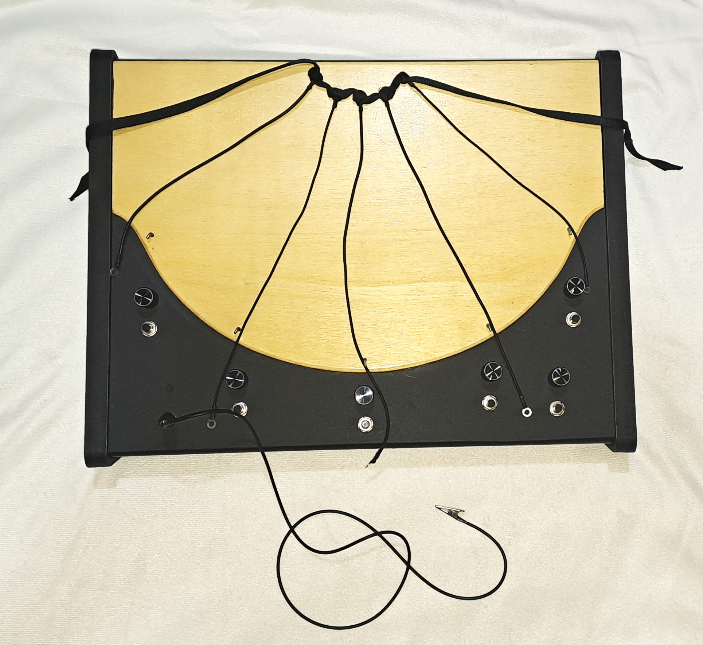

# Versions
## 2022-01-01 | **Electric_Khipu_ 9 strings**
|    |    |
|----|----|
| **Title** | 9 Strings Khipu | 
| **Photo** |  |
| | |

### Component list (*bit*) 

### Hardware 
|    | name		          | q.	  | description 	| Link  
|----|------------------|-------|---------------|------------------------------------------------------------------------------|
| 1  | Conductive Rubber String 	| 9	  | Adafruit Conductive Rubber Cord Stretch Sensor 	| [pdf](../documentation/components/adafruit-Conductive Rubber Cord Stretch Sensor.pdf)|
| 2  | Ring Terminals	   | 18	  |                | |
| 3  | Potentiometer 	   | 10	  |                | [pdf](../documentation/components/Potentiometer10K.pdf)|
| 4  | Switch	           | 10	  |	               | |
| 5  | Banana Plug       | 1    |                | |                
| 6  | Banana jack Male  | 1    |                | |
| 7  | Wool string       |      |                | |
| 8  | Custom Box	       | 1	  |		             | [folder](../documentation/components/box/9-strings/)|
| 9  | PCB	             | 1	  |		             | [folder](../components/circuit_board/)|

### Software
|    | name		          | description 	| Version | Link |  
|----|------------------|---------------|---------|---------------------------------------------------------------------|
| 1  | Khipu puredata  | Pure data patches and related file | 1 |[folder](../../code/puredata/) |
| 2  | Khipu Teensyduino | Firmaware for Teensy (Arduino IDE) | **9 strings** | [folder](../../code/Khipu_9strings_ino/)|
| 3  | Khipu Ableton Live | Ableton Live Proect | 1 | [folder](../../code/ableton/)

## 2020-01-01 | **Electric_Khipu_ 5 strings**
|    |    |    |
|----|----|----|
| **Title** | 5 String Khipu | 
| **Photo** |  | 
| | | 

### Component list (*bit*) 
### Hardware 
|    | name		          | q.	  | description 	| Link  
|----|------------------|-------|---------------|------------------------------------------------------------------------------|
| 1  | Conductive Rubber String 	| 5	  | Adafruit Conductive Rubber Cord Stretch Sensor 	| [pdf](../documentation/components/adafruit-Conductive Rubber Cord Stretch Sensor.pdf)|
| 2  | Ring Terminals	   | 10	  |                | |
| 3  | Potentiometer 	   | 6	  |                | [pdf](../documentation/components/Potentiometer10K.pdf)|
| 4  | Switch	           | 6	  |	               | |
| 5  | Banana Plug       | 1    |                | |                
| 6  | Banana jack Male  | 1    |                | |
| 7  | Wool string       |      |                | |
| 8  | Custom Box	       | 1	  |		             | [folder](../documentation/components/box/5-strings/)|
| 9  | PCB	             | 1	  |		             | [folder](../documentation/components/circuit_board/)|

### Software
|    | name		          | description 	| Version | Link |  
|----|------------------|---------------|---------|---------------------------------------------------------------------|
| 1  | Khipu puredata  | Pure data patches and related file | 1 |[folder](../../code/puredata/) |
| 2  | Khipu Teensyduino | Firmaware for Teensy (Arduino IDE) | **5 strings** | [folder](../../code/Khipu_5strings_ino/)|
| 3  | Khipu Ableton Live | Ableton Live Proect | 1 | [folder](../../code/ableton/)

