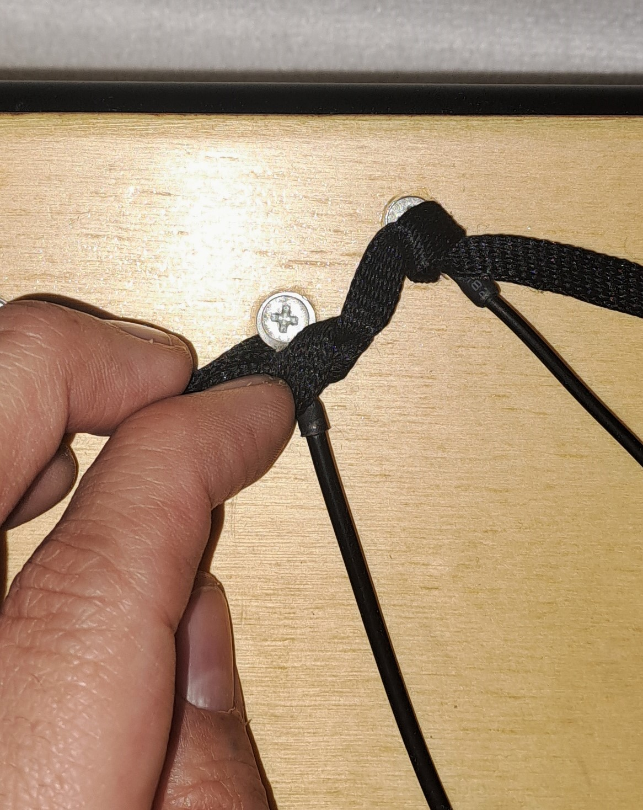

# Instructions

## Components

### Hardware 
|    | name		          | q.	  | description 	| Link  
|----|------------------|-------|---------------|------------------------------------------------------------------------------|
| 1  | LDR sensor 	    | 16	  | Light sensor 	| [pdf](../componens/Aokin_Light_Dependent_Resistor_(LDR)_Sensor_Module.pdf)|
| 2  | Potentiometers	  | 7	    | 		          | [pdf](../components/Potentiometer10K.pdf)|
| 3  | Teensy 2.0 	    | 1	    | microcontroller | [pdf](../components/teensy_2.0.pdf)|
| 4  | Custom Box	      | 1	    |		            | [folder](../components/box-kanchay_yupana)|

### Software
|    | name		          | description 	| Version | Link |  
|----|------------------|---------------|---------|---------------------------------------------------------------------|
| 1  | Yupana puredata  | Pure data patches and related file | 1 |[folder](../../code/puredata-kanchay_yupana) |
| 2  | Yupana Teensyduino | Firmaware for Teensy (Arduino IDE) | **2** | [folder](../../code/teensyduino_02-kanchay_yupana)|

## Mappings

## Developing Instructions

### Box
The box is made from acrylic and wood, following the provided schematics (initially tested with cardboard mockups until a satisfactory design was achieved).

The design is inspired by tabletop synthesizers and the layout of khipus displayed in museums.

This particular design is specifically inspired by [Adafruit’s MIDI Melody Maker](https://learn.adafruit.com/midi-melody-maker)

The wooden cover that interacts with the strings is laser-cut, varnished, and treated by a violin luthier (it functions like the pickguard of a guitar and must be durable).

References and sketches used for manufacturing are included in the repository.

The box includes a rear cover for easy component replacement.

### Electronic components

#### String
The strings are made from conductive rubber, available from [Adafruit](https://www.adafruit.com/product/519).

A more economical version (slightly thinner but functional) can be sourced from [Aliexpress](https://a.aliexpress.com/_EJniw1p).

The length of each string should be enough for knotting and securing. Not all strings are the same length.

#### Materials Needed:
1.	**Ring terminals** – size depends on the khipu’s dimensions and string thickness (2 per string)
2.	**Conductive rubber string**
3.	**Heat-shrink tubing** to protect and cover the ends (2 per string)

#### Steps to make the strings:
1.	Cut the string to the desired length.
2.	Cut 2 pieces of heat-shrink tubing to cover the ends.

3.	Slide the heat-shrink tubing onto the string, positioning it in the middle.

4.	Secure the string ends in ring terminals and fasten tightly.

  
  

5.	Cover the terminals with heat-shrink tubing to protect them.

6.	Apply heat to shrink the tubing and secure the ends.

#### Other Components:
- 5 **screws** and **nuts**: To secure the top ends of the strings.

- 5 **L-hooks** (grounded): To hang the strings and close the circuit.

- 6 **potentiometers** (10k ohms): 1 per string and 1 for general volume control.
- 6 **switches** or **buttons**: 1 per string to activate them individually and 1 for overall power.
- **Female Banana Jack connector** (grounded): Closes the circuit to enable interaction.
- **Cable with a Banana Jack male connector**: One end connects to the female jack; the other end has a metal clip for attaching to a ring or bracelet (used during performance to connect to the instrument).

- **Wool string**: Covers the upper screws and enhances the khipu’s aesthetic. In traditional khipus, a primary cord held the rest of the strings.

#### Internal Components

Potentiometers and buttons are individually wired using modular Dupont connectors for easy replacement.

The internal wiring of the strings mimics a simple [Light-Dependent Resistor (LDR) connected to an Arduino](https://www.c-sharpcorner.com/UploadFile/d15fb8/ldr-with-arduino/).
The top ends of the strings connect to 10k resistors and analog pins on the microcontroller. The resistors are pre-mounted on the circuit board, so the cables directly connect to designated analog pins.
For easy string replacement, cables connected to analog pins are also equipped with ring terminals, which ensure contact when tightened with nuts and screws.
The bottom ends of the strings are grounded. This is achieved by soldering a wire to the back of each L-hook, which is then connected to a ground pin via a Dupont connector.

### Microcontroller

The device uses a [Teensy 3.6](https://www.pjrc.com/store/teensy36.html)

It was chosen for its numerous analog pins and ease of programming as a MIDI controller. The Teensy connects and is programmed via USB, similar to an Arduino.

The circuit is modular, featuring female Dupont headers and integrated resistors for strings and buttons.

### Programming

Programming was done using [Teensyduino USB_MIDI examples](https://www.pjrc.com/teensy/td_download.html).

Adjustments were made to account for the strings’ variable outputs compared to potentiometers. Strings produce highly variable values, so they must be mapped individually in Ableton before uploading the full sketch.

#### MIDI Mapping in Ableton:
The khipu is recognized as a MIDI controller through Teensy. In Ableton, audio and effects are mapped to MIDI using the strings, similar to potentiometers.

Each string typically has its own track, controlled via its button, with the string adjusting the track’s volume.

#### Mapping in Pure Data (PD):
Mapping is simpler in PD. Each string’s MIDI value is selected and adjusted as needed. Example patches and noise effects are available in the repository:
[https://youtu.be/4NPOEp-sG_Q?t=4044](https://youtu.be/4NPOEp-sG_Q?t=4044)
[https://puredata.info/downloads/pd-extended](https://youtu.be/4NPOEp-sG_Q?t=4044)

### Performance notes

#### Knotting
To learn basic numerical khipu knotting, refer to this tutorial: [https://youtu.be/Af7qRxlaiFQ](https://youtu.be/Af7qRxlaiFQ)

Knots encode the khipu’s information, though not all khipus were numerical. In performances, the knotting process itself is more significant than the knots’ traditional meanings.

#### Final Notes
The instrument is highly variable and sensitive to the user’s conductivity, meaning it never sounds the same twice.